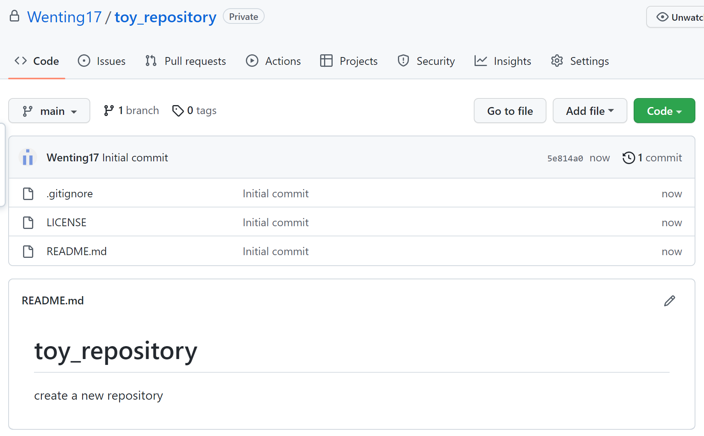
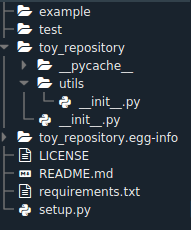
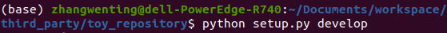
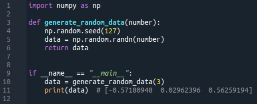
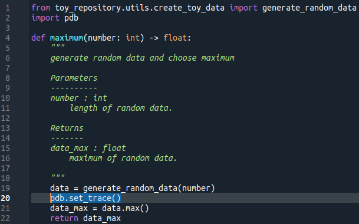
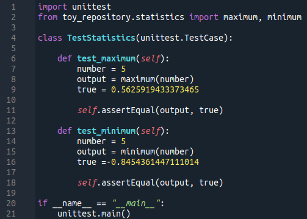
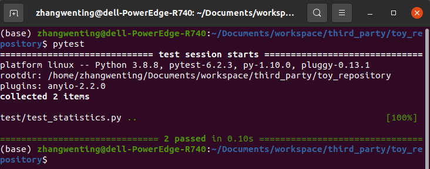
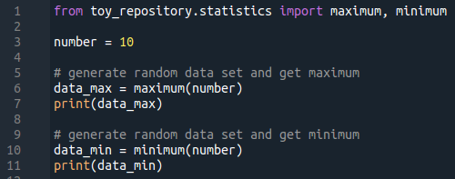

# toy_repository
create a new package

## 创建空仓库
github创建空仓库，设置如下：
- .gitignore: Python
- license: apache liscence 2.0

## 创建基本的包并安装

- git clone仓库到本地，创建包的基本结构，添加必要文件：
	- requirements.txt
	- toy_repository 各级目录下添加 \_\_init\_\_.py，toy_repository/\_\_init\_\_.py 中添加版本 \_\_version\_\_ == "0.0.1"
	- setup.py
	
	
	
- develop安装：在终端进入包目录，输入 python setup.py develop 进行安装

	

## 函数开发

- 定义与调用
	- 定义函数
	- 函数的简单使用
	
	

- 函数调试：使用 pdb.set_trace()，具体用法参考 [pdb](https://docs.python.org/3/library/pdb.html)

	

- 函数测试：[test_statistics.py](/test/test_statistics.py)
	- 测试函数
	
	
	- 使用pytest，运行所有的测试文件
	
	

- 函数用例：[use_statistics.py](/example/use_statistics.py)

	

